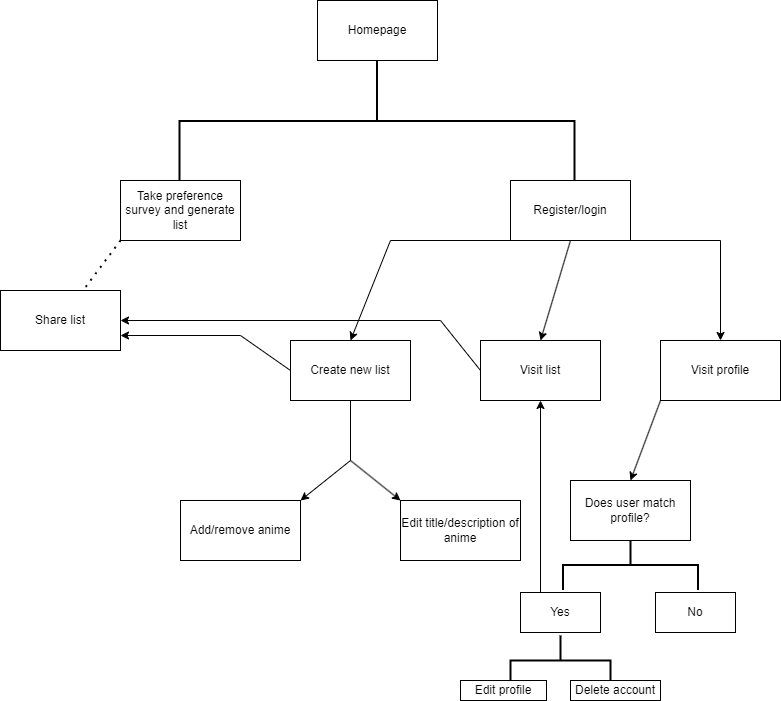

# Project Title: 

WhichAni

# URL: 

TBD

# Current Features:

## **User**

### Register/login/logout

Basic sign up and in/out functions so users are able to create and save their own lists. 

### Profile

Access to user profile pages with simple details and related lists. Ability to edit profile elements if accessed as identical user.

## **List**

### Generating Curated Lists

Users are able to generate a list of randomized but popular anime based on their preferences. 

### Creating Lists 

Users are able to create blank lists and add/remove anime as they see fit, as well as add their own notes in the event that they want to include a personal touch. These lists can then be shared via link.

### Deleting Lists

Lists can be deleted entirely if a user no longer wishes to keep their own creation. 

# Standard User Flow

# API 

https://docs.api.jikan.moe/

# Stack

Flask
bcrypt and Flask bcrypt
SQLAlchemy and Flask SQLAlchemy
WTForms and Flask WTForms
gunicorn
Jinja2
psycopg2-binary
requests

# Other

